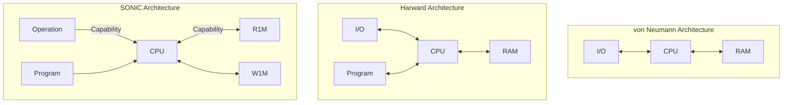

# RGB-I.0 consensus

## 1. Introduction

RGB is a client-side validated distributed smart contracting system.
It leverages an UTXO-based distributed blockchain (so-called *layer 1*)
for reaching the finality of the state;
however, it doesn't use it for neither ordering of transactions nor for storing a state,
unlike all other smart contract systems.
Thus, layer 1 in strict computer science terms doesn't serve as an RGB consensus,
since it doesn't fulfill any of the properties defining a distributing consensus protocol:
- ordering of transactions (RGB transactions are not published or broadcasted via blockchain);
- state machine replication (no state is replicated via layer 1);
- atomic broadcasts (since the ordering of layer 1 transactions doesn't matter for RGB).

Instead, RGB runs its own _client-side validated consensus_, where blockchain consensus
acts just as one of the components. This protocol is described in this standard.

## 2. Used Notations

We use standard mathematical symbols, including symbols of set theory.

Ordering of elements in set is denoted with $\succ$ and $\prec$.

Terms are defined by $\triangleq$, sets are indexed by subscripts $s_i \in \mathcal{S}$,
logical conditions are done with $\land$ (AND), $\lor$ (OR) and $\lnot$ (NOT),
$\Longleftrightarrow$ is used for _if and only if_ condition,
$\Rightarrow$ for _than_, $\nRightarrow$ for _else_, and $\perp$ is a program termination.

Data types are defined using standard mathematical number sets, such as
natural numbers $\mathbb{N}$, integers $\mathbb{Z}$,
non-zero natural numbers $\mathbb{N}^+ \triangleq \mathbb{N}\setminus\{0\}$
and finite field $`\mathbb{F}_q`$ (where $q$ is the order of the finite field).
The bit dimensions (except the finite field elements) are given as a subscript:
$`\mathbb{N}_{256}`$ with $`\mathbb{N}_8 \triangleq \mathbb{N}_8`$ used for both 8-bit
unsigned integers and bytes.
Binary strings (scalar arrays) of fixed size are given using power notation,
for instance, $`\mathbb{N}_8^{32}`$ is a 32-byte string.

Named data types are represented with capital Latin letters using LaTeX `mathbb` font style.
For instance, the boolean type is defined as a set $`\mathbb{B} \triangleq \{0, 1\}`$.

Scalar variables are given with Latin and Greek lowercase letters.

Tuples (ordered fixed-size set of objects of a different type) are denoted with angular brackets
$\langle \ldots \rangle$ to list the tuple elements
and with small Latin serif letters (like $\mathsf{a}, \mathsf{x}$) to represent immutable values.

Multivalued tuples, which may change over time (tuple variables) are denoted
and with capital Latin or Greek serif letters (like $\mathsf{C}$). to represent
a sequence or individual tuple values which evolve over time (like state objects),
with individual values being a lower-case indexed version of the same letter
($`\mathsf{c}_0, \mathsf{c}_i`$, etc).

We use tuple name and serif index to represent a named element of a tuple,
like in $`\mathsf{c}_i \triangleq \langle \mathsf{C_{Id}}, \ \ldots \rangle`$.

Variable-size sets of the same-typed objects (ordered or unordered) are denoted with
calligraphic uppercase Latin letters (like $\mathcal{S}$).
For representing set elements we use braces $`\{\ldots\}`$ and [set builder notation].
The type of variable-sized sets is given as an element type with a power component
specifying the range of the allowed set cardinality.
For instance, $`\mathbb{N}_8^{[0, 32)}`$ indicates a sequence of bytes with cardinality (length)
in a range of $0$ to $2^{32} - 1$.
Sets are differentiated by the ordering of their elements using index notation:
- $`\{ \cdots \}_\prec`$ for partially ordered sets;
- $`\{ \cdots \}_\preceq`$ for totally ordered sets;
- no index for unordered sets.

Unicode strings are represented as a sequence made of $\mathbb{U}$ set elements
(UTF-8 character set); ASCII strings as sequence made of $\mathbb{S}$ set elements.
If there are constraints on the type of ASCII characters which can be used in a string,
the constraint is either given verbally as an index (for instance, $`\mathbb{S}_\mathsf{printable}`$),
or as a wildcard $`\mathbb{S}_*`$ with detailed explanation of the constraints given in the text.

Functions with a well-defined algorithm are denoted by a serif Latin small-case names,
followed by a dot, function domain, arrow and function co-domain,
like $\mathsf{evaluate}: \mathcal{A} \rightarrow \mathcal{B}$.
Application of the function to arguments is written as $\mathsf{evaluate}(a_i)$.
Variables having a function type are written as small Greek letters in italic, $\phi$,
and their application as $\phi(x)$.
Inline functions depending on their previous values are defined using
$\mapsto$ instead of $\rightarrow$.

All numbers are encoded into and from a byte-strings with a little-endian convention.

## 3. Protocol Overview

In technical terms, RGB operates as partially replicated state machines (PRiSM),
which uses polynomial computer architecture SONIC
(State machine with Ownership Notation Involving Capabilities).

_Partially replicated_ means that not all the state is replicated between the instances
of the state machine; instead, only a part of the state required by each of the instances
is propagated.

_Polynomial computer_ means that the trace of the operations by the consensus protocol
can be arithmetized to polynomials,
making it possible to use any zk-STARK prover for zero knowledge compression.

_Ownership notation involving capabilities_ means that some types of state in RGB 
are assigned to specific parties (actors), and this assignment is made using _capabilities_,
which are implemented using a single-use seal cryptographic scheme.

RGB consensus uses the following underlying components:
- SONIC polynomial computer (its consensus-related layer named "UltraSONIC")
  with capability-based memory and zk-AluVM virtual machine,
  used for contract state evaluation/validation;
- RGB contracts, their state and state transitions;
- commitment schemes, using cryptographic hash functions;
- single-use seals, for providing capabilities and for finality.

The version of RGB consensus described in this document is named **RGB-I.0**.
You can find more on RGB version numbering in [RGB-6] standard.

## 5. SONIC Architecture

Most of the modern computers use modified von Neumann and Harvard architecture, derived from it.
While offering a convenient user experience, these architectures were not designed neither for
arithmetization, required in creation of zk-STARK proofs, nor for distributed system requirements,
or security and formal verification. For instance, random memory access has become the source
of most hacks and security bridges for over 50 years.
So while it is possible to adopt von Neumann-style architecture for zk-STARK provers
(one may refer to [Cairo]), this results in large proof size, high computational resource demand
and no ability in doing formal analysis of any program.

Instead of following such an approach, RGB is using a different architecture, named SONIC,
which is specifically designed for formal verification, UTXO-based models, and security.
The architecture uses zk-AluVM virtual machine, immutable memory cells of two types
(read-once memory, R1M; and write-once memory, W1M), and capability-based R1M access.



### zk-AluVM virtual CPU

[AluVM] is a modular framework for developing RISC instruction set architectures and registry-based
virtual machines, based on category theory. RGB uses zk-AluVM version of it, 
which comes with GFA256 instruction set architecture, supporting arithmetic operations with
finite field elements. It is extended by USONIC and RGB-specific instructions
for accessing operation data and memory.
The complete spec on the instruction set architecture is given in 
[Appendix I].

### Memory

The SONIC architecture supports two types of addressed memory:
- **read-once memory** (R1M), or _descructible memory_ $\mathcal{D}$, having capability-based access
  and used for storing "owned" state accessible only by a valid actor providing a 256-bit
  **authentication token**;
- **write-once memory** (W1M), or _immutable memory_ $\mathcal{I}$, which can be accessed by any
  party and is used to define a global contract state.

Both types of memory are made of addressable memory cells.
An address consists of a 256-bit id of operation and 16-bit output number
which creates the memory cell:

$`\mathsf{a} \triangleq \langle \mathsf{Id}(c_i), j \rangle \in \mathbb{A} \triangleq \mathbb{N}^{32}_8 \times \mathbb{N}_{16}`$

Memory data are based on **composed values** data type,
which is an ordered sequence of zero to four finite field elements:

$`\mathbb{V} \triangleq \bigcup_{n=0}^{4} \mathbb{F}_q^n`$

_Read-once memory_ cells consist of a single _composed value_ $\sigma$,
an _authentication token_ $\alpha$, and an optional **locking condition** $\mathcal{L}$:

$`\forall \mathsf{d}_i \in \mathcal{D}(\mathsf{a}) : \mathsf{d}_i \triangleq \langle \sigma, \alpha, \mathcal{L} \rangle \in \mathbb{D} \triangleq \mathbb{V} \times \mathbb{F}_q \times \{ \varnothing, \ell \}`$

A locking condition, when present as $\ell$, is an entry point into AluVM program (see next section),
which should succeed on execution in order for the cell to be read and destroyed.
If a locking condition is not present, the memory cell is destroyed on the first read operation,
and can't be anymore accessed or referenced.

_Immutable memory_ cells consist of a a single _composed value_ $\sigma$,
and an optional binary raw data $\mathcal{R}$, up to $2^{16}$ bytes:

$`\forall \mathsf{e}_i \in \mathcal{I}(\mathsf{a}) : \mathsf{e}_i \triangleq \langle \sigma, \mathcal{R} \rangle \in \mathbb{I} \triangleq \mathbb{V} \times \{ \varnothing, \mathbb{N}_8^{[0; 2^{16})} \}_\preceq`$

The raw data do not participate in the validation process, and thus are never arithmetized.
Their purpose is to provide more context information for the user, and they are parsed and processed
using ABI rules and standard library code (see [RGB-1010] standard).

### Program

AluVM operates as a Turing machine, running on a "tape" of SONIC program,
with the following modifications:
- the machine can't change the cells on the tape (the program is read-only);
- it has access to external data outside of the tape: 
  - current contract operation,
  - addressable [memory](#memory);
- its execution is bounded by so-called **complexity measure**;
  each execution of an instruction increase complexity counting register in AluVM virtual CPU,
  and when the value exceeds a limit provided as a part of a [contract Codex](#codex),
  it halts, ending in a failed state.

At each step a machine executes a single instruction.
The complete list of all instructions and their encodings,
as well as information about registers (i.e. Instruction Set Architecture)
is given in the [Appendix I].

AluVM comes with a set of special-purpose control registers.
Three of these registers influence halting conditions for a machine:
- `CH`: Halting register. When set to `true`, halts program when `CK` is set to the failed state.
- `CK`: Check register, which is set on any failure (accessing register in `None` state, zero
        division, etc.). Can be reset if `CH` is `false`.
- `CO`: Test register, which acts as a boolean test result (also a carry flag).
        Its value is checked by branching and some halting instructions.
- `CA`: Complexity accumulator / counter.
        Each instruction has a computational complexity measure.
        This register sums the complexity of executed instructions.
- `CL`: Complexity limit. If this register has a value set, once `CA` reaches or exceeds its value,
        the VM will set `CK` to a failed state.

The program halts on the following conditions:
1. On an unconditional halting instruction execution (see table of all instructions);
2. On a conditional halting instruction execution
   _if_ the value of instruction-specific register (`CO` or `CK`) is set;
3. On any invalid operation (division by zero, accessing non-existing value or memory cell, etc.)
   _if_ the `CH` is set;
4. On a jump to an unknown location
   (unknown library id or an offset outside the bounds of the library code segment);
5. Once the complexity limit given in `CL` is exceeded,
   _if_ the `CL` register contains a value, and `CH` is set.

The complexity limit `CL` and halting flag `CH` are initialized using contract parameters
from a [codex](#codex). When a complexity limit and halting are defined, an AluVM program
is guaranteed to halt; allowing termination analysis.

Execution of a program results in an execution trace, consisting of the instructions,
input values (values in registers before instruction was executed),
output values (new values in registers once the instruction is executed),
and hidden parameters, coming from the external data, if they were accessed.
The execution trace may be encoded using elements of finite field $\mathbb{F}_q$
and fed to a zk-STARK prover. Specific details of the encoding and selection of zk-STARK
prover is outside of the scope of this document and is a subject of the future work.

To run a program, AluVM must be provided with an unordered set of known **libraries**,
used by the program, and an **entry point** 
$`\mathsf{e} \triangleq \langle \mathsf{Id_{lib}} \in \mathbb{N}^{32}_8, p \in \mathbb{N}_{16} \rangle`$,
consisting of a library id and an offset in the library code segment.
The number of known libraries is unbounded; so the complexity limit mechanism
is the only way to bound computation of a program.
For the information about AluVM library, its structure, constraints, etc please refer to the
[AluVM] documentation.

## 6. Contracts

Contract is an instance of RGB protocol. RGB consensus operates on the contract level,
and doesn't include (as of version I.0) any cross-contract functionality[^1].

Since RGB operates as a partially-replicated state machine,
each party has a partial view over contracts, named **local contract**. 
A local contract is defined as

$$\mathsf{C} \triangleq \langle \mathsf{\Theta}, \mathcal{O} \setminus \{ \mathsf{c}_0 \} \rangle$$

where $\Theta$ is a contract issue and
$\mathcal{O}$ is the locally known part of the contract operations
(excluding genesis operation $\mathsf{c}_0$ already present in $\Theta$, see below).

The contract **issue** defines *unique* and *global* properties of a contract;
it must be known to all parties (i.e. present in each *local contract*) and
it is represented by a tuple

$$\mathsf{\Theta} \triangleq \langle v, \mathsf{m}, \mathsf{k}, \mathsf{c}_0 \rangle$$

| Symbol         | Type                                                                                                                                                | Value range  | Meaning                         |
|----------------|-----------------------------------------------------------------------------------------------------------------------------------------------------|--------------|---------------------------------|
| $v$            | $\mathbb{N}_8$                                                                                                                                      | constant $0$ | RGB issue datastructure version |
| $\mathsf{m}$   | $`\langle \mathbb{B}, \mathbb{N}_8, \mathbb{N}_{64}, \mathbb{B}^{48}, \mathbb{S}_*^{[1, 100)?}, \mathbb{S}_\mathsf{printable}^{[1, 4096)} \rangle`$ | n/a          | Contract metadata               |
| $\mathsf{k}$   | tuple (see below)                                                                                                                                   | n/a          | Codex                           |
| $\mathsf{c}_0$ | tuple (see below)                                                                                                                                   | n/a          | Genesis operation               |

A commitment to the *issue* data represents a unique and global **contract id**
$\mathsf{Id}(\mathsf{C})$, or $\mathsf{C_{Id}}$.

The contract metadata $\mathsf{m}$ define contract-specific parameters, which include
(in the order of their position in the tuple):
1) boolean indicating whether the contract is a test contract,
2) a specific consensus layer 1 used by the contract,
3) ISO 8601 timestamp of the moment the contract is issued,
4) a set of feature flags (must be zeros for RGB-I.0),
5) optional name of the contract, which must start with a capital letter or a `_` symbol,
  and may contain up to 99 ASCII letters, numbers, or `_` symbols,
6) an identity string of the contract issuer, made of ASCII printable characters.

### Codex

Codex is a set of parameters and rules which define contract business logic 
but do not define any form of a state. The _contract business logic_ does not mean
the way how the state transitions are created; instead, it defines how an arbitrary
state transition, created with any possible rules, gets validated. If it passes the validation,
its business logic is valid; if it doesn't - it is not. This paves the way to a huge
scalability, as well as much more compact zk-STARK proofs; since any zk-proof just proves
a result of a computation, not specifying the exact way of performing the computation itself.
The mistake of blockchain developers was to put the actual state transition function into
the blockchain, which doesn't scale. Client-side validation, implemented in RGB, fixes that.

Thus, an RGB codex defines a state transition _validation_ functions,
which are differentiated by a state transition type:
one contract may have multiple forms of state transition,
which can be seen as mutating methods of the contract.

Next, a codex defines the following contract parameters:
- Specific finite field size, which defines finite field $`\mathbb{F}_q`$ order $q$ and
  bit dimensions for finite field type variables, denoted hereinafter as $`\|q\|_\mathsf{bits}`$;
- cryptographic hash function used in commitment schemes;
- specific single-use seal protocol, which also defines the subset of specific blockchain networks,
  and commitment schemes;
- specific blockchain.

More formally, codex is a tuple

$$\mathsf{k} \triangleq \langle v, n, d, t, f, q, \mathsf{\Gamma}, \mathsf{\Lambda}, V \rangle$$

| Symbol             | Type                                                                               | Value range                              | Meaning                                                                           |
|--------------------|------------------------------------------------------------------------------------|------------------------------------------|-----------------------------------------------------------------------------------|
| $v$                | $\mathbb{N}_8$                                                                     | constant $0$                             | RGB codex datas tructure version                                                  |
| $n$                | $\mathbb{N}_8^{[0, 255]}$                                                          | n/a                                      | Contract name, parsed as Unicode UTF-8 string                                     |
| $t$                | $\mathbb{N}_{64}$                                                                  | any                                      | ISO 8601 timestamp of codex creation                                              |
| $f$                | $\mathbb{B}^{32}$                                                                  | constant $0$                             | Feature flags (must be zeros in RGB-I.0)                                          |
| $q$                | $\mathbb{Z}_q$                                                                     | $[0, \mathbb{Z}_q)$                      | Finite field order                                                                |
| $\mathsf{\Gamma}$  | $\langle \mathbb{B}, \mathbb{B}, \mathbb{N}_{64} \rangle$                          | n/a                                      | Configuration for a [zk-AluVM computing core] for state transition verification   |
| $\mathsf{\Lambda}$ | $\langle \mathbb{B}, \mathbb{B}, \mathbb{N}_{64} \rangle$                          | n/a                                      | Configuration for a [zk-AluVM computing core] for memory access lock verification |
| $V$                | $`\mathbb{N}_{16} \rightarrow \langle \mathbb{N}_8^{32}, \mathbb{N}_{16} \rangle`$ | Valid entry points into known AluVM libs | Entry points for verification functions using AluVM libs                          |

Configurations for a [zk-AluVM computing core] are 3-tuples, which values correspond to:
1. Boolean flag indicating whether a VM must halt on the first occurrence of a failure;
2. Boolean indicating whether a complexity limit is set;
3. 64-bit natural number representing the complexity limit (of the #2 is set).

For the details on complexity limits, please address [AluVM documentation].

The same codex may be used by multiple contracts, in the same way as a class,
defined with a programming language, may instantiate multiple objects.

It is important to note that multiple contracts may re-use the same codex.
In this way, there appears a natural differentiation between contract issuers and codex developers,
with the former being specializing in financial services, assets, etc;
and the second being specialists in computer science.


### Contract State

A **local contract state** is fully defined by a set of its operations, $\mathcal{O}$.

Since RGB consensus needs to operate as a polynomial computer with a computation trace being
arithmetizable as a set of polynomial constraints, the state of a contract at the level of
consensus must be always represented by a mathematical construct
made of elements of the finite field $\mathbb{Z}_q$, provided in the [contract codex](#codex).
This state is not human-readable and must be processed using a specific ABIs and interfaces
to be read by humans; however, this part lies outside the consensus definition, belonging
to the RGB standard library, defined in [RGB-1010] standard.

Contract memory is a tuple $\langle \mathcal{D}, \mathcal{I} \rangle$,
consisting of destructible $\mathcal{D}$ and immutable $\mathcal{I}$ memory cells,
as described in the [Memory chapter](#memory).

- The destructible memory cells represent a **read-once** (R1M) type of memory,
  which is defined by contract operations destructible outputs and removed once accessed
  by any of the contract operations referencing it as one of its inputs.

- The immutable memory cells represent a **write-once multiple-access** (W1M) type of memory,
  which is defined by contract operations immutable outputs,
  and accessed by contract operations immutable inputs.

The state of the memory is defined as a result of executing the
$\mathsf{evaluate}: \mathcal{O} \rightarrow \langle \mathcal{D}, \mathcal{I} \rangle$ procedure,
as described in the [Evaluate section](#evaluate-procedure).


### Contract Operation

Contract operation is a tuple, $`o_i \triangleq \langle \mathsf{c}_i, S_i, u_i \rangle`$, consisting of:
- client-side information of contract state change, represented by a tuple $\mathsf{c}_i$;
- an unordered map of seal definitions performed by an operation,
  $`S_i(x): y_x \in \mathcal{Y_i} \rightarrow s_x`$, where $s_x$ is a seal definition;
- a seal closing witness information,
  which values must belong to a set of either unit value, or a specific witness $w_i$:
  $`u_i \in \{ \varnothing, w_i \}`$.

A client-side part of the operation is represented by a tuple

$$\mathsf{c}_i \triangleq \langle v, \mathsf{C_Id}, \phi, \lambda, \Upsilon, \mathcal{A}, \mathcal{B}, \mathcal{Y}, \mathcal{Z} \rangle$$

where

| Symbol          | Type                                                     | Meaning                                  |
|-----------------|----------------------------------------------------------|------------------------------------------|
| $v$             | $\mathbb{N}_8$                                           | RGB consensus version (must be $0$)      |
| $\mathsf{C_Id}$ | $\mathbb{N}_8^{32}$                                      | Contract id                              |
| $\phi$          | $\mathbb{N}_{16}$                                        | Call id                                  |
| $\lambda$       | $\mathbb{N}_{16}$                                        | Nonce                                    |
| $\Upsilon$      | $\mathbb{V}$                                             | Witness data                             |
| $\mathcal{A}$   | $\{\mathbb{A} \times \mathbb{V}\}_\preceq^{[0, 2^{16})}$ | Destructible memory refs (input)         |
| $\mathcal{B}$   | $\{\mathbb{A}\}_\preceq^{[0, 2^{16})}$                   | Immutable memory refs (input)            |
| $\mathcal{Y}$   | $\{\mathbb{D}\}_\preceq^{[0, 2^{16})}$                   | Destructible memory declaration (output) |
| $\mathcal{Z}$   | $\{\mathbb{I}\}_\preceq^{[0, 2^{16})}$                   | Immutable memory declaration (output)    |

Contract *genesis* is a special type of operation, containing no input:
$$\mathsf{c}_0 \triangleq \langle \pi, \mathsf{k_{Id}}, \phi, \lambda, \Upsilon, \varnothing, \varnothing, \mathcal{Y}, \mathcal{Z} \rangle$$

Each operation is identified by an operation id, $\mathsf{Id}(c_i)$, which is computed by
hashing serialized data for the client-side part of the operation,
as described in the [Commitments section](#7-commitments).
For the genesis, the value of $\mathsf{k_{Id}}$
is replaced with the value of $\mathsf{C_{Id}}$ before the operation id is computed.

### Set of Operations

Each contract is defined by a partially ordered set of contract operations 
$`\mathcal{O} \triangleq \{ o_i \}`$.
An element of this set is a tuple, $`o_i \triangleq \langle c_i, S_i, u_i \rangle`$, consisting of:
- client-side information of contract state change, $`c_i`$;
- an unordered map of seal definitions performed by an operation, 
  $`S_i: d_j \in \mathcal{Y}_i \rightarrow s_j`$, where $`s_j`$ is a seal definition;
- a seal closing witness information, 
  which values must belong to a set of either unit value, or a specific witness $`w_i`$: 
  $`u_i \in \{ \varnothing, w_i \}`$.

The set $\mathcal{O}$ has an initial element, called **genesis** $`o_0`$, for which $`u_i = \varnothing`$.
There might be other operations for which $`u_i = \varnothing`$;
these operations are named _state extensions_.

All operations in $\mathcal{O}$ are partially ordered via rule

$`o_i \prec o_j \Longleftrightarrow (\exists \ y \in \mathcal{Y}_i: y_\mathsf{addr} \in \mathcal{A}_j) \vee (\exists \ x \in \mathcal{X}_i: x_\mathsf{addr} \in \mathcal{B}_j)`$

which means that if there exists at least one output of $c_i$ which is used by $c_j$, or a global
state defined in $c_i$ which is read by $c_j$, than $o_i$ precedes $c_j$.

If the $\mathcal{O}$ is not a directed acyclic graph and the above rule can't be fulfilled without
collisions, the operation set must be recognized as invalid.

### Evaluate Procedure

The contract state is evaluated using the following $\mathsf{evaluate}$ procedure applied to the set of
contract operations:

```math
\mathsf{evaluate} \triangleq \forall o_i \in O: \\
(\forall \ a \in \mathcal{A}_i \ \exists! \ d \in \mathcal{D}_i: \mathsf{addr}(d) = a) \\
\wedge \ (\forall \ b \in \mathcal{B}_i \ \exists! \ e \in \mathcal{I}_i: \mathsf{addr}(e) = b) \\
\wedge \ \mathsf{verify}(w_i, \mathcal{Y}_i) \\
\wedge \ \mathsf{exec}(\mathsf{k}, \wp, \mathcal{I}_i, \mathcal{D}_i, c_i) \\
\Rightarrow 
\begin{cases}
    \mathcal{D}_{i+1} \mapsto (\mathcal{D}_i \setminus \mathcal{A}_i) \cup \mathcal{Y}_i, \\[6pt]
    \mathcal{I}_{i+1} \mapsto \mathcal{I}_i \cup \mathsf{global}(c_i) \\
\end{cases} \\
\nRightarrow \perp
```

The first part of the algorithm checks whether an operation is correct, and depending on the result
the contract state is either evolved (middle expression), or the further validation terminates.

The $\mathsf{addr}$ procedure returns a memory address for a given memory cell.

The $\mathsf{verify}$ procedure performs verification of a set of single-use seals and a witness
according to the [LNPBP-8] standard.

The $\mathsf{exec}$ procedure executes verification program and 
programs checking fulfilment of individual lock conditions for the spent inputs,
and is provided with codex data, a set of known AluVM libraries $\wp$,
access to the memory and client-side operation data.
It succeeds if and only if at the halting of the AluVM machine its register `CK` is not set.

## 7. Commitments

Commitments are created using binary data serialization using [strict encoding], specifically:
1. Numbers are serialized in little endian format,
   using a number of bytes required to cover the bit dimension of the used numeric type.
2. Sum types (enums, including primitive and with associated data) are prefixed with a 8-bit tag.
3. Fixed-size arrays are encoded as is, with no prefixing.
4. Variable-size collections (objects representable as mathematical sets,
   either ordered or unordered, including sequences, partially ordered sets, ordered sets, maps)
   are prefixed with the size of the collection (cardinal number) in little-endian format,
   using the number of bytes which fully covers the maximal allowed collection dimension;
   followed by elements of the collection, serialized one after other.
5. Totally ordered sets must be serialized in the order of the elements
6. Partially ordered and unordered sets do not participate in the RGB consensus.
7. Maps are serialized with elements corresponding to the key and value, composed as a tuple.
   Keys of the ordered maps must represent a totally ordered set and
   define the order of the serialization of key-value tuples.
8. Product types (tuples) are serialized according to the order of their elements, with no prefixes.

Data are serialized into the hashers, which usually uses a prefix (tagged) to uniquely codify
the type of the produced commitment. Collections may also be merklized, in order to allow
compact profs of inclusion. The complete structure of data serialization for producing commitments,
including tagged prefixes and details of merklization, is given in the [Appendix II].


## 8. Additional Information

### RGB on Bitcoin

When RGB is used on top of Bitcoin, the following parameters apply:

1. A _contract issue_ must reference specific bitcoin blockchain & network as a value for its
   $\mathsf{m}_2$ field (layer 1 in contract metadata) using the Table 1.
2. TxO-based single-use seals must be used, as they are defined in the [LNPBP-10] standard.


### Security Assumptions

The security of RGB consensus relies on the following two assumptions

- The selected cryptographic hash function is collision-resistant;
- The used single-use seal protocol is secure.


### Reference Implementation

The reference implementation is provided in repositories, and libraries are listed
in the Consensus section of [RGB-3] standard.


## 9. Acknowledgements

The whole work was inspired by the earlier ideas of Peter Todd on the [client-side validation]
and [single-use seals] protocols. Giacomo Zucco was the first, who had analyzed its possible
applications and implications for Bitcoin blockchain and Lightning Network.
Adam Borko had suggested ideas and critics on the zk-STARK compatibility of the protocol.
Olga Ukolova had provided a lot of feedback and comments during the protocol design phase.


## Appendix I. RGB Instruction Set Architecture


## Appendix II. Commitments Specification


[^1]: However, one may still achieve cross-contract interaction outside of the consensus layer,
      for instance using atomic swaps.

[RGB-3]: https://github.com/RGB-WG/RFC/blob/master/RGB-0003.md

[RGB-6]: https://github.com/RGB-WG/RFC/blob/master/RGB-0006.md

[RGB-1010]: https://github.com/RGB-WG/RFC/blob/master/RGB-01010.md

[LNPBP-6]: https://github.com/LNP-BP/LNPBPs/blob/master/lnpbp-0006.md

[LNPBP-8]: https://github.com/LNP-BP/LNPBPs/blob/master/lnpbp-0008.md

[LNPBP-10]: https://github.com/LNP-BP/LNPBPs/blob/master/lnpbp-0010.md

[set builder notation]: https://en.wikipedia.org/wiki/Set-builder_notation

[strict encoding]: https://strict-encoding.org

[AluVM documentation]: https://docs.aluvm.org

[zk-AluVM computing core]: https://docs.rs/aluvm/latest/aluvm/struct.CoreConfig.html

[Cairo]: https://cairo-lang.org

[AluVM]: https://docs.rs/aluvm

[Appendix I]: #appendix-i-rgb-instruction-set-architecture
